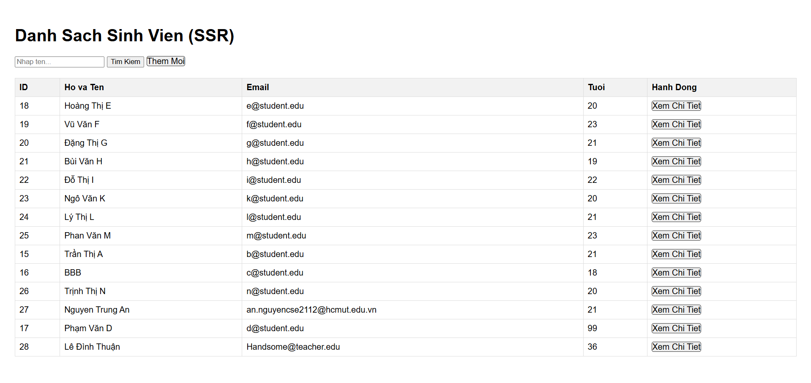
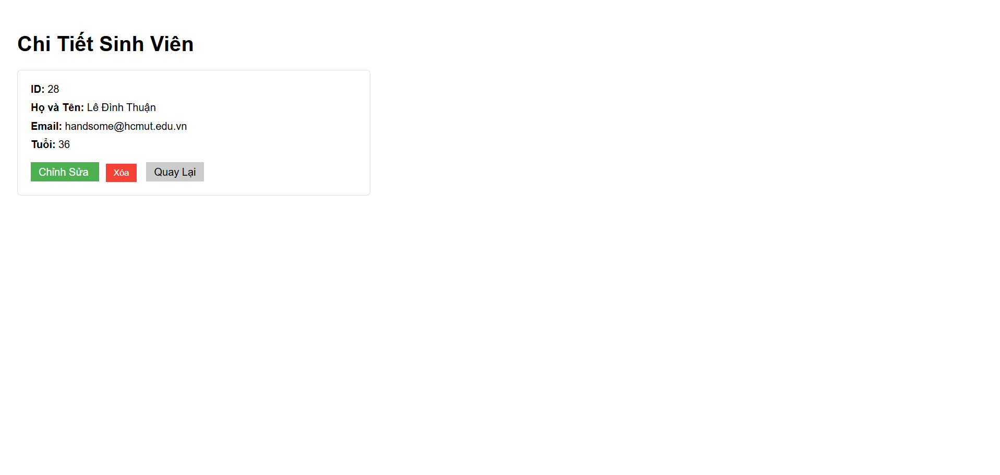
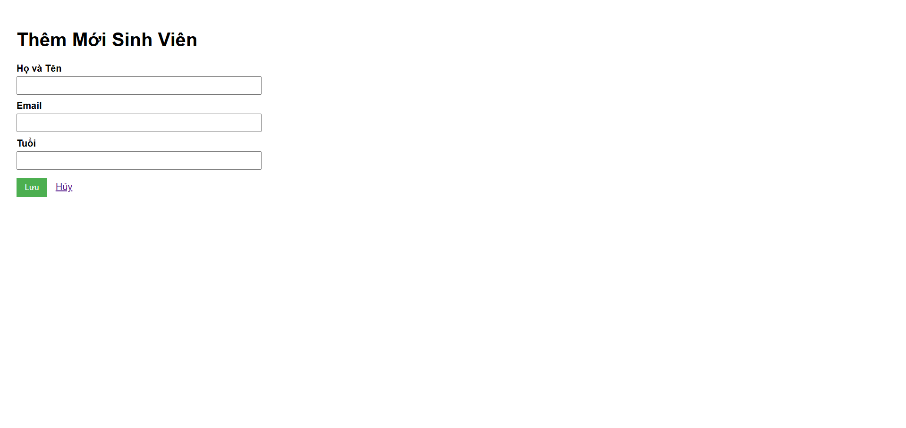
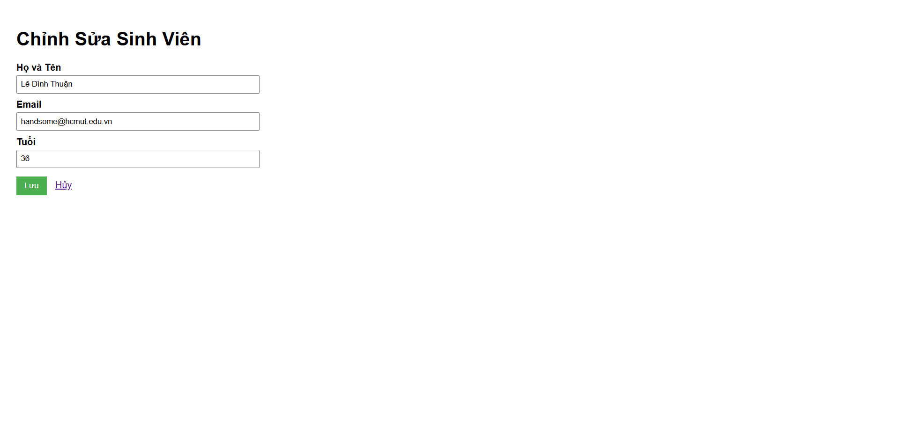
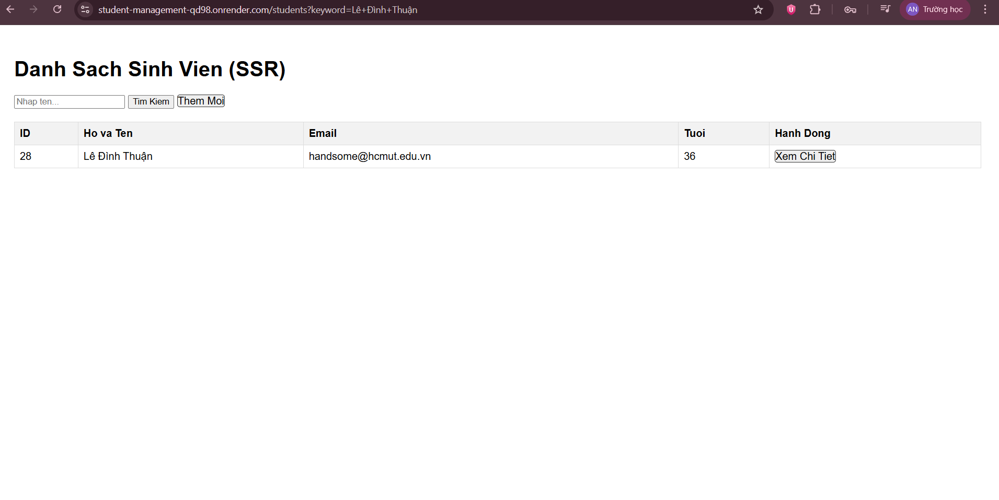

# Student Management System – Spring Boot & Thymeleaf

## 1. Thông tin nhóm

| STT | Họ và tên       | MSSV    | Email                                                                 |
| --- | --------------- | ------- | --------------------------------------------------------------------- |
| 1   | Nguyễn Trung An | 2310027 | [an.nguyencse2112@hcmut.edu.vn](mailto:an.nguyencse2112@hcmut.edu.vn) |
| 2   | Trần Gia Kiệt   | 2311784 | [kiet.tran05tgkpy@hcmut.edu.vn](mailto:kiet.tran05tgkpy@hcmut.edu.vn) |

---

## 2. Public URL của Web Service (Lab 5)

Ứng dụng đã được deploy và có thể truy cập tại:

**[https://student-management-qd98.onrender.com/students](https://student-management-qd98.onrender.com/students)**

Trang web hiển thị danh sách sinh viên, hỗ trợ tìm kiếm, xem chi tiết, thêm mới, chỉnh sửa và xóa sinh viên theo mô hình SSR (Server Side Rendering).

---

## 3. Hướng dẫn chạy dự án ở môi trường local

### 3.1. Yêu cầu hệ thống

- Java JDK 17 trở lên
- Maven 3.9+
- PostgreSQL (hoặc sử dụng cấu hình database đã deploy trên Render)
- IDE: IntelliJ IDEA / VS Code (khuyến nghị IntelliJ IDEA)

---

### 3.2. Các bước chạy dự án

**Bước 1: Clone source code**

```bash
git clone https://github.com/Trung4n/student-management.git
cd student-management
```

**Bước 2: Cấu hình Database**

Trong file `application.properties` (hoặc `application.yml`), cấu hình:

```properties
spring.datasource.url=jdbc:postgresql://<host>:<port>/<database>
spring.datasource.username=<username>
spring.datasource.password=<password>

spring.jpa.hibernate.ddl-auto=update
spring.jpa.show-sql=true
```

**Bước 3: Build & chạy ứng dụng**

```bash
mvn clean install
mvn spring-boot:run
```

**Bước 4: Truy cập hệ thống**

```
http://localhost:8080/students
```

---

## 4. Trả lời câu hỏi lý thuyết trong Lab

### 4.1. Ràng buộc Khóa Chính (Primary Key)

**Hiện tượng:**
Cố tình insert một sinh viên có `id` trùng với sinh viên đã tồn tại trong database, hệ quản trị cơ sở dữ liệu trả về lỗi:

```
UNIQUE constraint failed / duplicate key value violates unique constraint
```

**Giải thích:**
Khóa chính (Primary Key) có nhiệm vụ **định danh duy nhất** mỗi bản ghi trong bảng.
Database bắt buộc mọi giá trị của khóa chính phải **không trùng lặp** và **không NULL**.
Nếu cho phép trùng khóa chính, database sẽ không thể xác định chính xác một bản ghi, dẫn đến sai lệch dữ liệu và phá vỡ tính toàn vẹn của hệ thống.

---

### 4.2. Toàn vẹn dữ liệu (Constraints)

**Thí nghiệm:**
Insert một sinh viên nhưng bỏ trống cột `name`.

**Kết quả:**

- Nếu cột `name` **không có ràng buộc NOT NULL**, database **vẫn cho phép insert**.
- Nếu có `NOT NULL`, database sẽ báo lỗi.

**Ảnh hưởng khi code Java đọc dữ liệu:**

- Khi dữ liệu không chặt chẽ, phía Java có thể nhận giá trị `null`.
- Điều này dễ gây ra:
  - `NullPointerException`
  - Lỗi hiển thị dữ liệu
  - Vi phạm logic nghiệp vụ

⇒ Vì vậy, **ràng buộc dữ liệu nên được kiểm soát cả ở Database lẫn Application layer** (Hibernate Validation).

---

### 4.3. Cấu hình Hibernate – Dữ liệu bị mất khi restart

**Hiện tượng:**
Mỗi lần tắt ứng dụng và chạy lại, dữ liệu cũ trong database bị mất.

**Nguyên nhân:**
Trong cấu hình Hibernate có sử dụng:

```properties
spring.jpa.hibernate.ddl-auto=create
```

**Giải thích:**

- `create`: mỗi lần ứng dụng khởi động, Hibernate **xóa toàn bộ bảng cũ và tạo lại schema mới**
- Do đó, dữ liệu cũ bị mất hoàn toàn

**Giải pháp:**
Sử dụng:

```properties
spring.jpa.hibernate.ddl-auto=update
```

để Hibernate chỉ cập nhật schema mà không xóa dữ liệu hiện có.

---

Ok, mình sẽ **viết lại hoàn chỉnh Mục 5 trong README.md**, theo đúng yêu cầu của bạn:

- **Ảnh được nhúng trực tiếp từ folder `screenshots/`**
- **Mô tả rõ từng trang**
- **Ghi rõ URL, method (GET/POST), chức năng**
- Giọng văn **chuyên ngành – học thuật**
- Phù hợp để giáo viên đọc và đối chiếu yêu cầu Lab

Bạn chỉ cần **thay thế toàn bộ Mục 5 cũ** bằng nội dung dưới đây.

---

## 5. Screenshot và mô tả các module trong Lab 4

Các hình ảnh minh họa giao diện được lưu trong thư mục `screenshots/` và được trình bày tương ứng với từng chức năng của hệ thống.

---

### 5.1. Trang Danh Sách Sinh Viên (List View)

**Đường dẫn (URL):**

```
GET /students
```

**Mô tả chức năng:**

- Hiển thị danh sách toàn bộ sinh viên dưới dạng bảng.
- Mỗi sinh viên bao gồm các thông tin: ID, Họ và Tên, Email, Tuổi.
- Tích hợp ô nhập liệu cho phép tìm kiếm sinh viên theo tên.
- Cung cấp nút **“Thêm Mới”** để điều hướng sang trang tạo sinh viên.
- Mỗi dòng dữ liệu có liên kết **“Xem Chi Tiết”** để truy cập trang thông tin chi tiết của sinh viên tương ứng.
- Các sinh viên có tuổi nhỏ hơn 18 được hiển thị nổi bật nhằm minh họa xử lý logic hiển thị phía server.

**Screenshot:**

```markdown

```

---

### 5.2. Trang Chi Tiết Sinh Viên (Detail View)

**Đường dẫn (URL):**

```
GET /students/{id}
```

**Mô tả chức năng:**

- Hiển thị đầy đủ thông tin chi tiết của một sinh viên:
  - ID
  - Họ và Tên
  - Email
  - Tuổi

- Cung cấp nút **“Chỉnh Sửa”** để điều hướng sang trang cập nhật thông tin sinh viên.
- Cung cấp nút **“Xóa”** sinh viên:
  - Hiển thị hộp thoại xác nhận (Confirm Dialog) trước khi thực hiện xóa.
  - Sau khi xóa thành công, hệ thống điều hướng về Trang Danh Sách Sinh Viên.

**Screenshot:**

```markdown

```

---

### 5.3. Trang Thêm Mới Sinh Viên (Create View)

**Đường dẫn (URL):**

```
GET  /students/create
POST /students/create
```

**Mô tả chức năng:**

- Hiển thị form nhập liệu bao gồm các trường:
  - Họ và Tên
  - Email
  - Tuổi

- Áp dụng validation phía server thông qua Hibernate Validator.
- Sau khi lưu thành công, hệ thống tự động điều hướng về Trang Danh Sách Sinh Viên.

**Screenshot:**

```md

```

---

### 5.4. Trang Chỉnh Sửa Sinh Viên (Edit View)

**Đường dẫn (URL):**

```
GET  /students/edit/{id}
POST /students/edit/{id}
```

**Mô tả chức năng:**

- Hiển thị form chỉnh sửa với các trường:
  - Họ và Tên
  - Email
  - Tuổi

- Dữ liệu cũ của sinh viên được điền sẵn để người dùng dễ dàng cập nhật.
- Sau khi lưu thành công:
  - Điều hướng về Trang Danh Sách Sinh Viên
    _(hoặc có thể cấu hình quay về Trang Chi Tiết tùy yêu cầu)_

**Screenshot:**

```markdown

```

---

### 5.5. Chức Năng Tìm Kiếm Sinh Viên (Search)

**Đường dẫn (URL):**

```
GET /students?keyword={name}
```

**Mô tả chức năng:**

- Cho phép người dùng tìm kiếm sinh viên theo **tên** thông qua ô nhập liệu trên Trang Danh Sách.
- Tìm kiếm được thực hiện theo phương thức **GET**, tham số `keyword` được truyền thông qua query string.
- Hệ thống xử lý tìm kiếm phía server và trả về danh sách sinh viên thỏa điều kiện.
- Nếu không nhập từ khóa, hệ thống hiển thị toàn bộ danh sách sinh viên.
- Kết quả tìm kiếm được hiển thị dưới dạng bảng tương tự Trang Danh Sách Sinh Viên.

**Luồng xử lý:**

- Người dùng nhập tên sinh viên vào ô tìm kiếm và nhấn nút **“Tìm Kiếm”**.
- Controller nhận tham số `keyword` từ request.
- Service gọi Repository để truy vấn dữ liệu phù hợp.
- Kết quả được đưa vào Model và render lại trang danh sách bằng Thymeleaf.

**Screenshot:**

```markdown

```

---

## 6. Tổng kết

Dự án triển khai đầy đủ các yêu cầu của Lab 4 và Lab 5, bao gồm:

- Quản lý sinh viên theo mô hình MVC
- Server Side Rendering với Thymeleaf
- Tích hợp Spring Data JPA và PostgreSQL
- Deploy thành công lên môi trường cloud (Render)
- Áp dụng ràng buộc dữ liệu và validation đúng chuẩn
